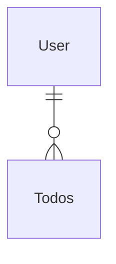
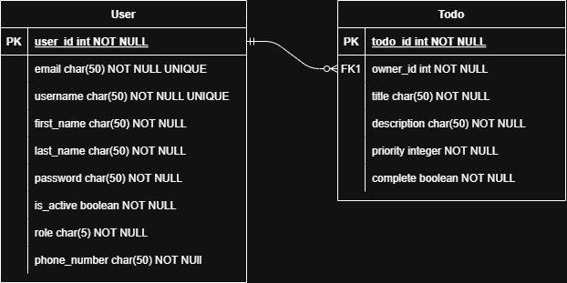

# Todos Service

This project focuses on the Todos project, which was responsible for Users to manage and track their Todos.

## Features

- **User Management:** Admin can perform full CRUD on system users, users can create a profile, login, and change password.
- **Todos Management:** User can manage, perform full CRUD on their todos.


## ERD



## Classes


## API Design

## Todo Route

### Create Todo

- method: `POST`
- uri: `api/v1/todos`
- request:
  ```json
  {
   "complete": false,
   "description": "Milk, eggs, and bread",
   "priority": 2,
   "title": "Buy groceries"
  }
  ```
- response:
  ```json
  {
   "complete": false,
   "description": "Finish the FastAPI course by the end of the week",
   "id": 1,
   "priority": 1,
   "title": "Complete FastAPI Course"
  } 
  ```

##### Get One Todo
- method: `GET`
- uri: `api/v1/todos/1`
- response:
  ```json
  {
    "complete": false,
    "description": "Finish the FastAPI course by the end of the week",
    "id": 1,
    "priority": 1,
    "title": "Complete FastAPI Course"
  }
  ```

##### Get Many Todos
- method: `GET`
- uri: `api/v1/todos`
- response:
  ```json
  [
    {
      "complete": false,
      "description": "Finish the FastAPI course by the end of the week",
      "id": 1,
      "priority": 1,
      "title": "Complete FastAPI Course"
    }
  ]
  ```

##### Update One Todos
- method: `PUT`
- uri: `api/v1/todos/1`
- response:
- request:
  ```json
  {
   "complete": false,
   "description": "Milk, eggs, and bread",
   "priority": 2,
   "title": "Buy groceries"
  }
  ```
- response:
  ```json
  {
   "complete": false,
   "description": "Milk, eggs, and bread",
   "id": 1,
   "priority": 1,
   "title": "Buy groceries"
  }
  ``` 

##### Delete One Todo
- method: `DELETE`
- uri: `api/v1/todos/1`
- response: 204 Not Content


## User Route

### Create User

- method: `POST`
- uri: `api/v1/users`
- request:
  ```json
  {
    "email": "john.doe@example.com",
    "first_name": "John",
    "is_active": true,
    "last_name": "Doe",
    "password": "verycomplexpassword",
    "phone_number": "111-111-1111",
    "role": "USER",
    "username": "johndoe"
  }
  ```
- response:
  ```json
  {
    "email": "john.doe@example.com",
    "first_name": "John",
    "id": 1,
    "is_active": true,
    "last_name": "Doe",
    "phone_number": "111-111-1111",
    "role": "USER",
    "username": "johndoe"
  }
  ```

##### Get One User
- method: `GET`
- uri: `api/v1/users/1`
- response:
  ```json
  {
    "email": "john.doe@example.com",
    "first_name": "John",
    "id": 1,
    "is_active": true,
    "last_name": "Doe",
    "phone_number": "111-111-1111",
    "role": "USER",
    "username": "johndoe"
  }
  ```

##### Get Many Users
- method: `GET`
- uri: `api/v1/users`
- response:
  ```json
  [
    {
      "email": "john.doe@example.com",
      "first_name": "John",
      "id": 1,
      "is_active": true,
      "last_name": "Doe",
      "phone_number": "111-111-1111",
      "role": "USER",
      "username": "johndoe"
    }
  ]
  ```

##### Update One Users
- method: `PUT`
- uri: `api/v1/users/1`
- response:
- request:
  ```json
  {
    "email": "john.doe@example.com",
    "first_name": "John",
    "id": 1,
    "is_active": true,
    "last_name": "Doe",
    "phone_number": "111-111-1111",
    "role": "USER",
    "username": "johndoe"
  }
  ```
- response:
  ```json
  {
    "email": "john.doe@example.com",
    "first_name": "John",
    "id": 1,
    "is_active": true,
    "last_name": "Doe",
    "phone_number": "111-111-1111",
    "role": "USER",
    "username": "johndoe"
  }
  ``` 

##### Delete One Users
- method: `DELETE`
- uri: `api/v1/users/1`
- response: 204 Not Content

## Auth Route

### Login

- method: `POST`
- uri: `api/v1/auth`
- request:
  ```json
  {
    "grant_type": "password",
    "password": "verycomplexpassword",
    "username": "johndoe"
  }
  ```
- response:
  ```json
  {
    "access_token": "string",
    "token_type": "string"
  }
  ```

##### Change Password
- method: `POST`
- uri: `api/v1/users/1`
- request:
  ```json
  {
    "new_password": "morecomplexpassword",
    "old_password": "verycomplexpassword"
  }
  ```

##### Get My Profile
- method: `GET`
- uri: `api/v1/users/my-profile`
- response:
  ```json
  {
    "email": "john.doe@example.com",
    "first_name": "John",
    "id": 1,
    "is_active": true,
    "last_name": "Doe",
    "phone_number": "111-111-1111",
    "role": "USER",
    "username": "johndoe"
  }
  ```